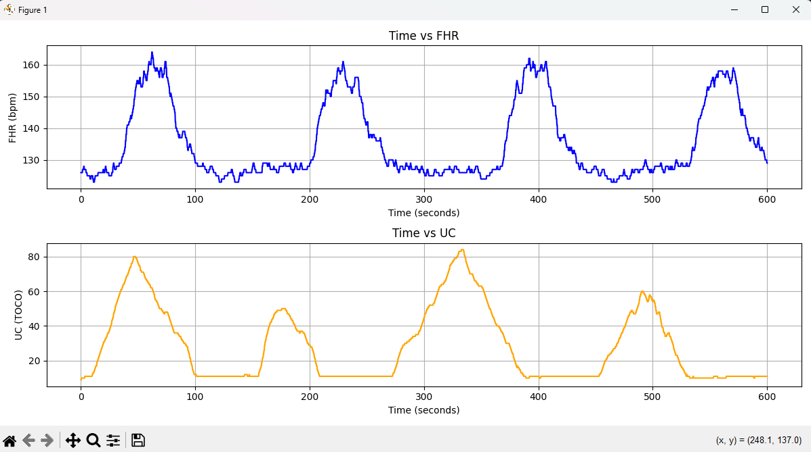

# Fetal Heart Rate and Uterine Contraction Data Analysis

## Project Description
This project focuses on analyzing fetal heart rate (FHR) and uterine contraction (UC) data collected from medical devices monitoring labor progress. The primary goal is to extract meaningful insights from the data, including detecting key patterns and calculating important statistics, such as identifying peaks in uterine contractions and measuring their duration.

## Key Objectives
- **Peak Detection**: Analyze UC data to detect significant peaks using signal processing techniques. Peaks correspond to uterine contractions, which are crucial indicators in labor monitoring.

- **Peak Width Analysis**: For each detected UC peak, the width (duration) is calculated, and peaks wider than 30 seconds are identified. These wide peaks are often of particular interest in medical contexts, as they may indicate sustained contractions.

- **Duration Calculation**: Once wide peaks are detected, the average duration of these peaks is calculated to provide an overall understanding of the UC patterns over time.

- **Graphical Representation**: The data is visualized in graphs for a clearer understanding of the trends and patterns in both fetal heart rate and uterine contractions.

## Tools and Techniques
- **Python**: The entire analysis is done in Python using libraries like `pandas` for data manipulation, `scipy.signal` for peak detection, and `matplotlib` for data visualization.
  
- **Data Processing**: The project involves reading time-series data (FHR and UC) from CSV files and performing signal processing to identify meaningful patterns.

- **Peak Detection**: Using `scipy.signal.find_peaks`, the peaks in the UC data are detected and analyzed.

- **Graphing**: FHR and UC data are plotted for visual inspection of trends and correlation between fetal heart rate and uterine contractions.

## Outcome
The project provides an automated way to analyze and visualize FHR and UC data, identifying significant peaks in uterine contractions, calculating their durations, and offering critical insights into the labor process.
